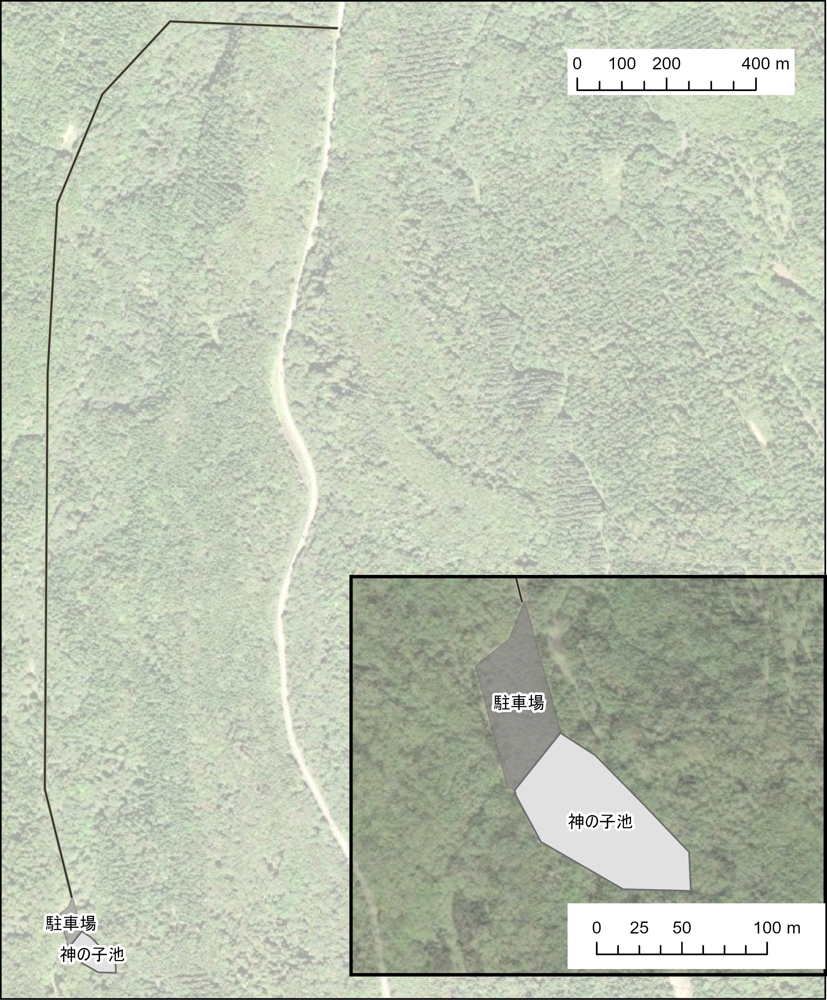

```{r source}
# 前処理用ファイルをソースとする

source("kaminoko_2025_preparation.R")
```

# タイトル

自然観光地における入域料の支払意思額にみる選好の多様性―北海道神の子池を事例として―

# はじめに

　自然観光地に入域料等の形で利用者負担制度を導入することには、管理費用の確保、混雑緩和などのメリットがあり、海外では途上国を中心に広く進められている。国内では2015年に施行された地域自然資産法により、地域の自然環境保全と持続可能な利用推進に必要な費用負担の一部を入域料として利用者に求めることができるようになった。しかしこれはあくまで特定の地区や施設の管理を目的としたものである。国立公園全体を対象としているわけではなく、利用者負担が自然公園法において明確に位置づけられているわけではない（愛甲他2025）。したがって、自然観光地への利用者負担制度の導入は日本においてまだ初期的段階にあるといえる。

　入域料の金額設定には幅広い関係者による合意形成が必要である。そのための参考値を求めるためにCVMにより自然観光地に対する支払意思額（WTP）を明らかにする研究は有益である。WTPの平均値や中央値がそのまま入域料になるわけではなく、実際の金額設定には地域内の負担の公正さへの配慮も必要であるし、収集したお金の使途をステークホルダーに丁寧に説明する等の配慮が社会的受容を促すにあたり重要となる。その意味で、WTPはあくまで議論の出発点であるといえる（Laarman, Jan G., and Hans M. Gregersen. 1996）。一方で、入域料を対象とした国内のCVM研究は支払の実態に着目した研究が多く、現状追認的なものに留まっていると指摘されている（愛甲他2025）。社会的受容をどのように促進するかという観点からの入域料研究はまだ乏しいといえるだろう。

　入域料の社会的受容という観点に立つと、来訪者の選好の多様性を把握することは重要である。たとえば、原生的な自然を好む来訪者は手つかずの自然観光地に価値を認めるからこそ、そうでない訪問者よりも入域料の使途に敏感に反応するかもしれない。あるいは、同じ来訪者であっても、消費者としての観点に立てば利便性を重視するが、市民としての観点に立てば環境の持続性や公正な財分配を重視するといったことが考えられる。WTPの平均値や中央値をそのまま入域料の参考値としてしまうことは、以上のような選好の多様性を覆い隠してしまうことで、将来的な利害対立の原因となる可能性がある。

　本研究の目的は、北海道神の子池を事例として、自然観光地の入域料に対する支払意思額を規定する要因を、来訪者の選好の多様性という観点から探索的に明らかにすることである。とくに、自然観光のあり方に関する価値観の違いとしての「手つかず志向」に着目し、あわせて評価視点の違い（市民的視点／消費者的視点）も考慮することで、平均的な支払意思額だけでは捉えられない異質性を検討する。

# 調査対象地の概要

　入域料に関わる選好の多様性を理解するには、その背景となる当該の自然観光地の特徴を把握しておく必要がある。そこで、本章で調査対象地の特徴を整理した上で、次章で選好の多様性を把握するための枠組みを提示する。先に特徴を簡単にまとめておくと、この調査対象地の特徴は、整備が不十分で利便性が低いにもかかわらず来訪者が多い点にある。このことは、来訪者が単純な利便性のみを基準に評価しているわけではない可能性を示唆しており、選好の多様性が現れている事例であると考えられる。

　本研究が調査対象地とする神の子池は、北海道斜里郡清里町の森林内に位置する小規模な湧水池であり、2017年に風景保護の観点から阿寒摩周国立公園へ編入された。周囲220ｍ、水深5ｍの小さな池であるが、火砕流の微粒子を含み、青い波長の光が乱反射するため青く見えるのが特徴である（知床博物館協力会ブログより）。町内の観光スポットの中で年間来訪者数は最も多い。2019年の年間来訪者数は82,645人であり、コロナ禍では5万人前後まで落ち込んだが、2022年以降は増加傾向で、2023年時点は69,188人である（『清里町商工振興計画 令和7～11年度』）。清里町の2026年2月時点の人口が3,537人であるので、訪問者数はその20倍ほどになる。

　清里町市街より道道摩周湖斜里線を経て林道に入り、約2km林道を進むと駐車場にたどり着き、そこからすぐに神の子池の木道入り口に接続している（図参照）。航空写真からは林道の状況を把握することは難しいが、実際には未舗装で道幅も狭く、大型・中型車両は通行止めとなっている。訪問客は小型車両やバイクで訪れるが、小型車両同士でもすれ違うのが困難な箇所が多い。駐車場は未舗装で、駐車区画はとくに明示されていない。駐車場内にはトイレがあるが男女共用の和式便所である。売店も休憩所もないため、訪問客は10～15分程度かけて池の周囲をめぐるとそのまま立ち去ることになる。

::: {.figure style="text-align: center;"}
{width="46%"}

神の子池の位置（黒い実線は林道を示す）
:::

　神の子池に関してこれまでに行われた整備としては、2015年12月に池周囲に設置された木道が挙げられる。これは、観光客の増加にしたがい池の中に立ち入ったりゴミを投げ込んだりする者が現れ、池への影響が懸念されるようになったためである。木道には柵がついており、柵の向こうは立ち入り禁止となっている。自然環境の保全を目的とした最小限の整備が行われているのが現状であるといえる。

　以上のように、神の子池はアクセスが悪く、設備も充実していないにも関わらず、多くの観光客が訪れている。林道やトイレ、駐車場を整備すれば観光地としての魅力をさらに高めることができる可能性も考えられるが、逆に、観光地化が進んでいないことが神の子池の魅力だと考える訪問客も存在するかもしれない。整備が適切であるかどうかを判断するには訪問者が神の子池に何を求めているかを明らかにする必要があるだろう。このような訪問者の選好の多様性については次章で考察する。

# 選好の多様性を捉える枠組み

## 手つかず志向

　神の子池は、整備が不十分であるにも関わらず多くの訪問客を惹きつけている自然観光地である。整備を進めればより多くの訪問客にとって魅力的な自然観光地にすることができるとは限らない。なぜなら、整備することでかえってその自然観光地の原生的な魅力が損なわれてしまうことがあるからである。これは、自然観光地における訪問者の体験の多様性に関する議論と関連している。こうした議論は、ROS（recreation opportunity spectrum）と手つかず志向（purism）という概念にもとづくものである。

　ROSとは、多様なレクリエーション体験を利用者に提供するという考え方のもと、レクリエーション地域の計画を策定するための枠組みである。たとえば、スリルや冒険、原始的体験を求める利用者は原生的な空間で長時間の登山のような活動を選択し、安全や快適、便利を求める利用者は人工的で整備の行き届いた空間でドライブやピクニックを楽しむ、といったようひ人々はレクリエーション体験に対する異なる選好を持つ。ROSを考慮することで、原生的な自然を求める訪問者の多い地域はなるべく整備を控え、逆に安全性や快適性を求める訪問者の多い地域は整備を推進する、といった管理指針が立てられる（八巻）。

　ROSを実践するには訪問者のタイプを把握する必要がある。そこで用いられるのが手つかず志向（purism）である。キャンプサイトが整備されていること、周囲の訪問者が少ないこと、いった項目に対する態度を問うリッカート尺度の質問を8～14程度設定し、それらの平均値の大きさによって訪問者を分類する（Sæþórsdóttir, Anna Dóra. 2010、Vistad, Odd Inge, and Marit Vorkinn. 2012など。質問項目の内容や数は研究によって多少異なる）。既存研究では複数の自然観光地で訪問者に質問紙調査を行い、地点ごとで手つかず志向の高い訪問者の割合を求め、各地点の整備の是非に関する提言を行っている。

　ROSについては国内でも研究・実践事例がみられるが少数であり、とくに手つかず志向を用いた研究はほとんどみられない。これは、日本人と自然とのかかわりの独自性が関連している可能性が考えられる。鬼頭は手つかずの原生自然を称揚するアメリカの環境倫理を批判し、自然との生業・生活を通した相互的な関係性を重視する、非西洋社会に適した環境倫理のあり方を問い直した。鬼頭の観点からすれば、手つかず志向を非西洋社会に適用することは不適切であると思われる。

　鬼頭の議論において事例としてあげられているのは白神山地において釣りや山菜採りを日常的に行う住民たちの営みであり、いわば里山的な自然とのかかわりに限定されている。しかし日本における自然とのかかわり方が必ずしも里山的なものであるとは限らない。とくに北海道における自然観光地の場合、むしろ原生的な自然と関わることが評価されているように思われる。少なくとも神の子池に関しては住宅地と離れており、住民との日常的なかかわりはみられない。以上から、手つかず志向の概念が日本の自然観光地においてどのように当てはまるのかは、理論から一義的に判断することはできず、実証的に検討する必要がある。

## 市民選好と消費者選好

　手つかず志向に基づき自然観光地を評価する来訪者は、一般的な意味での消費者とは異なる観点を持つ可能性がある。つまり、利便性や快適性、安全性のような管理者側から提供されるサービスに対してかえってネガティブな評価を与え、自然観光地の整備を最小限にとどめることにポジティブな評価を与えることが考えられる。

　SagoffはCVMを批判する文脈で、自然を評価する際の人々の観点として、「市民選好」と「消費者選好」のふたつを挙げている。Sagoffの挙げる例をそのまま用いると、豊かな森林を切り開いて開発したスキー場があるとして、消費者としての観点（消費者選好）からはそのスキー場に行きたいと考えるが、市民としての観点（市民選好）からはスキー場開発に反対する、という矛盾する態度が同一人物にみられることがある。これは、経済学の立場からは矛盾する選好順序を持つという意味で合理性基準に反しているが、日常的にみられる人間行動に反するものではないだろう。このように考えると、神の子池においてもCVM調査において消費者選好と市民選好のいずれの観点で回答を求めるかによって回答傾向が異なる可能性が考えられる。

　ただし、一般的な意味での消費者と異なる観点から自然観光地を評価するからといって、それが市民選好の観点であるとは限らない。消費者選好が自身の満足のみを重視する観点であるのに対し、市民選好は社会全体にとって何が望ましいかという観点からものごとを評価する観点である。手つかず志向が強い来訪者は、自然は手つかずで残しておくことが社会全体にとって望ましいというアメリカの環境倫理に近い考え方を持つ可能性もあるが、逆に、単に手つかずの自然から得られる個人的満足を重視しているだけである可能性もある。後者の場合は、市民選好というよりも消費者選好の一種に含められるだろう。環境倫理学の観点からは一定の示唆が得られるものの、それらが実際の行動や評価にどのように反映されるかについては、実証的な検討が必要である。

　本研究では、以上の枠組みにもとづき、神の子池来訪者のWTPがどのような選好の違いによって規定されるかを探索的に検討する。具体的には、手つかず志向を表す指標および市民選好・消費者選好のフレーミングがWTPに与える影響を分析し、自然観光地における選好の多様性と入域料の社会的受容との関連について検討する。

# 調査方法

## 調査概要

　調査は2025年6月から7月にわたり実施した。実施日と回収数は表○の通りである。なお、CVMの回答においては無回答や誤回答が一定数確認されたため、分析では適切に回答されたサンプルのみを用いる（詳細は次章）。神の子池周囲の木道入り口で待機し、周遊を終えた訪問者に回答を依頼した。ただし、7月20-21日は虫の大量発生により調査地点を適宜変更した。調査は著者らおよび研究室学生により実施した。

```{r data-count}
knitr::kable(
  df |> count(date),
  caption = "表○：調査実施日と回収数",
  booktabs = TRUE
)
```

## 調査設計

### CVM質問の設計

　CVM質問で用いたシナリオは表○の通りである。神の子池では土砂流入の防止や林道整備などの維持管理が行われている。本研究では、これらの維持管理を継続するとともに、利便性向上のために入域料収入を用いるというシナリオを設定した。

+------------------------------------------------------------------------------------------------------------------------------------------------------------------------------------------------+
| 神の子池の状態を維持するために、池の周りの土砂流入の防止、遊歩道補修、池の水質維持管理を行っています。また、池までの林道の整備（砂利等を敷いて平らにするなど）をしています。                   |
|                                                                                                                                                                                                |
| 仮に　神の子池の見学にお金（入域料）を徴収することになったとします。\                                                                                                                          |
| ※現時点において、料金を徴収することが計画されているわけではありません。                                                                                                                        |
|                                                                                                                                                                                                |
| この入域料によって、現在の池の維持管理はこれからも確実におこなわれ、さらに森林浴を楽しむことのできる遊歩道の整備や駐車場の整備など池を訪問する観光客の利便が良くなる整備が実施されるとします。 |
|                                                                                                                                                                                                |
| なお、入域料を支払った場合は、あなたが使うことのできるお金が減り、支払わない場合は、神の子池を訪問することができない、ということをイメージしてください。                                       |
+------------------------------------------------------------------------------------------------------------------------------------------------------------------------------------------------+

: 表○：CVM質問のシナリオ

　回答形式は二段階二肢選択形式とした。一段階目の提示金額と二段階目の提示金額のパターンは表○のとおりである。回答者によって提示金額のパターンはランダムに変えてある。

+------------------+----------------------------------------------+--------------------------------------------------+
| 一段階目提示金額 | 二段階目提示金額（一段階目「支払う」回答者） | 二段階目提示金額（一段階目「支払わない」回答者） |
+------------------+----------------------------------------------+--------------------------------------------------+
| 100              | 300                                          | 50                                               |
+------------------+----------------------------------------------+--------------------------------------------------+
| 300              | 500                                          | 100                                              |
+------------------+----------------------------------------------+--------------------------------------------------+
| 500              | 1000                                         | 300                                              |
+------------------+----------------------------------------------+--------------------------------------------------+
| 1000             | 1500                                         | 500                                              |
+------------------+----------------------------------------------+--------------------------------------------------+

: CVM質問における提示金額のパターン

質問文には、市民選好の観点または消費者選好の観点から回答を求めるフレーミング情報を付した。どのフレーミング情報を提示するかは回答者ごとにランダムに割り当てた。フレーミング情報の内容については後述する。

### 変数の構成

　分析に用いる主な変数を表○にまとめた。なお、調査実施回によって一部の質問項目が異なる。

+--------------------+---------------------------------------------------------------------------------+------------------------------------------------------+
| 変数名             | 概要                                                                            | 備考                                                 |
+====================+=================================================================================+======================================================+
| 道内居住ダミー     | 居住地が北海道内であれば1、そうでなければ0                                      |                                                      |
+--------------------+---------------------------------------------------------------------------------+------------------------------------------------------+
| 訪問回数ダミー     | 神の子池訪問が初めてであれば1、そうでなければ0                                  |                                                      |
+--------------------+---------------------------------------------------------------------------------+------------------------------------------------------+
| 訪問満足度         | 神の子池訪問に関する満足度の10段階評価                                          | 詳細は後述。                                         |
+--------------------+---------------------------------------------------------------------------------+------------------------------------------------------+
| 手つかず志向ダミー | 手つかず志向関連の質問に基づく合成指標が一定水準以上であれば1、 そうでなければ0 | 詳細は後述。関連質問は7月20-21日調査票のみで用いた。 |
+--------------------+---------------------------------------------------------------------------------+------------------------------------------------------+
| 市民選好ダミー     | 市民選好フレーミングでの回答であれば1、そうでなければ0                          | 詳細は後述。                                         |
+--------------------+---------------------------------------------------------------------------------+------------------------------------------------------+

### 訪問満足度・手つかず志向・選好フレーミング

　訪問満足度は、神の子池訪問に関する総合満足度と、「景色・自然体験」、「池へのアクセスの良さ」、「トイレや駐車場などの設備」、「周辺観光スポットの充実具合」の4つの下位区分に関する満足度を、それぞれ10段階で評価したものである。これらの指標により、訪問者が神の子池のどの側面を評価しているかを多面的に把握することが可能となる。 　 　

　手つかず志向に関わる尺度は、Vistad and Vorkinn (2012) およびをSæþórsdóttir(2010)参考に作成した。Vistad and Vorkinn (2012)では自然観光地での体験を妨げる（高める）要因のリストを挙げてそれぞれについて評価している。本研究では神の子池の利用実態に合わせて表○のように項目の取捨選択および内容の修正を行った。各項目は7件法で評価し平均値を合成指標として用いた（Cronbachのα\>0.8）。評価値は値が大きいほど自然観光地での体験を妨げると回答者が評価していることを意味し、観光地における整備の程度に対する拒否の傾向を表す指標として位置づけられる。

+------------------------------------------+--------------------------------------------------------------------+
| 既存研究                                 | 本研究                                                             |
+------------------------------------------+--------------------------------------------------------------------+
| 食事や宿泊ができる山小屋がある           | 軽食やジュース、アルコールを購入できる売店がある                   |
+------------------------------------------+--------------------------------------------------------------------+
| 滞在中、大勢の他の訪問客に出会う         | 滞在中、大勢の他の訪問客に出会う                                   |
+------------------------------------------+--------------------------------------------------------------------+
| トイレ等が整備されたキャンプサイトがある | 入り口や登山口まで、観光バスでも通行できる広い道路が整備されている |
|                                          |                                                                    |
|                                          | 入り口や登山口付近に広い駐車場が整備されている                     |
+------------------------------------------+--------------------------------------------------------------------+
| 注目すべき場所には目印がある             | 美しい写真が撮れるスポットには目印の看板が設置されている           |
+------------------------------------------+--------------------------------------------------------------------+

: 既存研究と本研究の手つかず志向尺度の対応関係

　市民選好・消費者選好のフレーミング情報については、表○のようにCVM質問の回答の際にどの範囲の価値を考慮するかを指示する記述を付した。これはOvaskainen, & Kniivilä 2005を参照したもので、市民選好の場合は自身だけでなく社会全体の厚生への影響を考慮するよう指示し、消費者選好の場合は自身の厚生のみに対する影響のみを考慮するよう指示している。

+-------------------------------------------------------------------------------------------------------------------------------------------------------------------------------------+---------------------------------------------------------------------------------------------------------------------------------------------------------+
| 市民選好フレーミングの場合                                                                                                                                                          | 消費者選好フレーミングの場合                                                                                                                            |
+-------------------------------------------------------------------------------------------------------------------------------------------------------------------------------------+---------------------------------------------------------------------------------------------------------------------------------------------------------+
| もしも入域料が　〇〇円/人　だったとしたら、今回の訪問であなたは支払っていたと思いますか。あなた自身だけでなく、他の訪問者や町の住民にとっての神の子池の価値も考慮してお答えください | もしも入域料が　〇〇円/人　だったとしたら、今回の訪問であなたは支払っていたと思いますか。あなた自身にとっての神の子池の価値だけを考慮してお答えください |
+-------------------------------------------------------------------------------------------------------------------------------------------------------------------------------------+---------------------------------------------------------------------------------------------------------------------------------------------------------+

: 表〇：市民選好・消費者選好のフレーミング情報

# 分析結果と考察

## 基本属性

+--------------------+------------------------+-----------------------+------+
| 属性変数           | 分析サンプル（n =314） | 除外サンプル (n =167) | p値  |
+--------------------+------------------------+-----------------------+------+
| 性別               | 男性：53.2%            | 男性：53.5%           | 1.00 |
+--------------------+------------------------+-----------------------+------+
| 世代               | 10代：3.8%\            | 10代：4.2%\           | 0.52 |
|                    | 20代：20.1%\           | 20代：15.7%\          |      |
|                    | 30代：13.7%\           | 30代：10.2%\          |      |
|                    | 40代：15.6%\           | 40代：13.9%\          |      |
|                    | 50代：24.5%\           | 50代：25.9%\          |      |
|                    | 60代：17.5%\           | 60代：23.5%\          |      |
|                    | 70代以上：4.8%         | 70代以上：6.6%        |      |
+--------------------+------------------------+-----------------------+------+
| 居住地             |                        |                       |      |
+--------------------+------------------------+-----------------------+------+
| 人数               |                        |                       |      |
+--------------------+------------------------+-----------------------+------+
| 訪問回数           |                        |                       |      |
+--------------------+------------------------+-----------------------+------+
| 総合満足度（平均） |                        |                       |      |
+--------------------+------------------------+-----------------------+------+

属性変数によって欠損があるため、nは回答者数の最大値を示す。

## CVM回答の状況

# おわりに

# 引用文献

-   愛甲哲也, 庄子康, and 深津幸太郎. 2025. “国立公園における利用者による費用負担の展開とそのあり方に関する考察.” 林業経済研究 71 (2): 26–39.

-   山本清龍, 愛甲哲也, 町田怜子, et al. 2025. “国立公園で求められる利用者負担の展開.” ランドスケープ研究 89 (3): 262–65.

-   Laarman, Jan G., and Hans M. Gregersen. 1996. “Pricing Policy in Nature-Based Tourism.” Tourism Management 17 (4): 247–54.

-   八巻一成, 広田純一, 小野理, 土屋俊幸, and 山口和男. 2000. “利用者の多様性を考慮した森林レクリエーション計画.” 日本林学会誌 82 (3): 219–26. <https://doi.org/10.11519/jjfs1953.82.3_219>.

-   鬼頭秀一『自然保護を問いなおす』

-   Sagoff economy of the earth

-   Sæþórsdóttir, Anna Dóra. 2010. “Planning Nature Tourism in Iceland Based on Tourist Attitudes.” *Tourism Geographies* 12 (1): 25–52. <https://doi.org/10.1080/14616680903493639>.

-   Vistad, Odd Inge, and Marit Vorkinn. 2012. “The Wilderness Purism Construct — Experiences from Norway with a Simplified Version of the Purism Scale.” *Forest Policy and Economics*, Forest and Nature Based Recreation and Tourism, vol. 19 (June): 39–47. <https://doi.org/10.1016/j.forpol.2011.12.009>.

-   Ovaskainen, Ville, and Matleena Kniivilä. 2005. “Consumer versus Citizen Preferences in Contingent Valuation: Evidence on the Role of Question Framing.” *Australian Journal of Agricultural and Resource Economics* 49 (4): 379–94. <https://doi.org/10.1111/j.1467-8489.2005.00309.x>.
